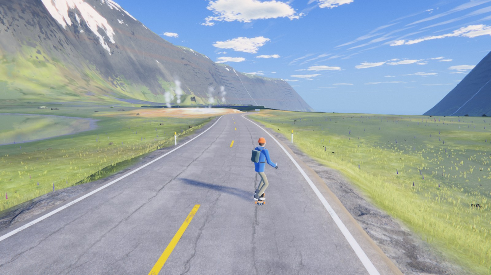
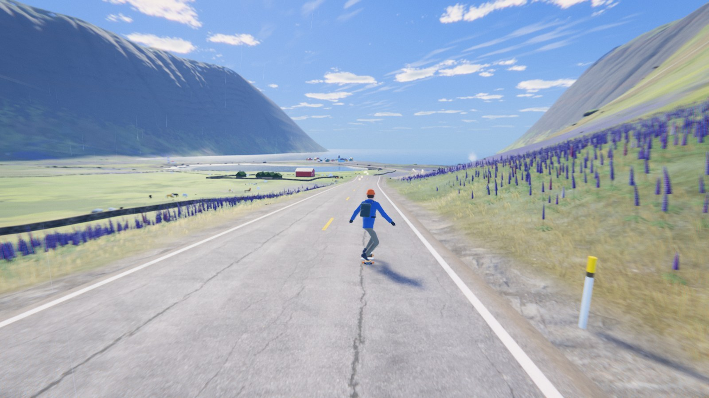
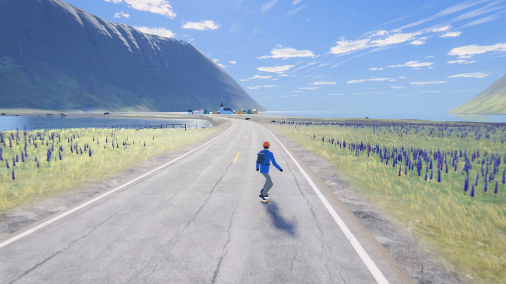
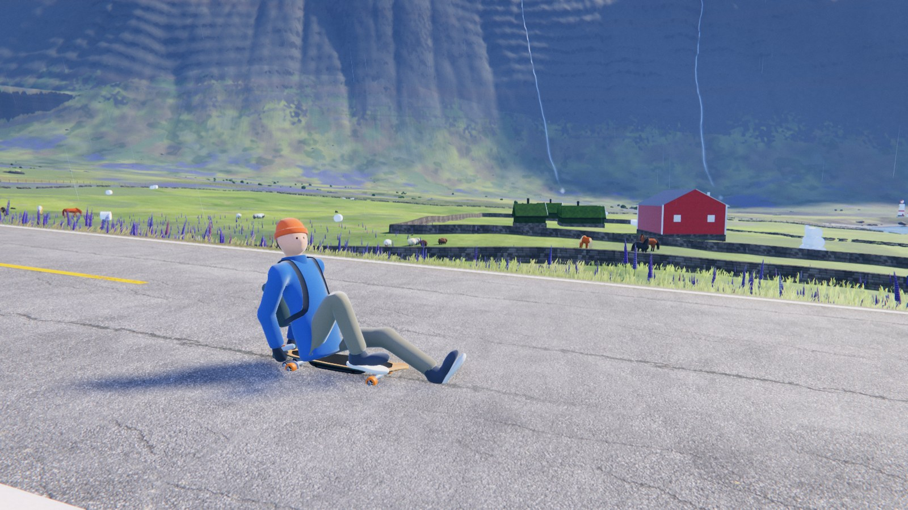
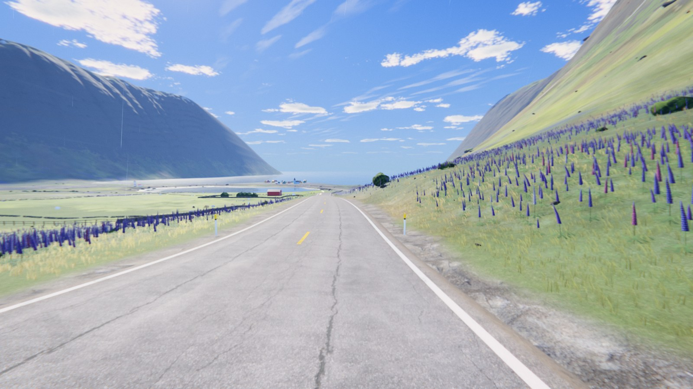
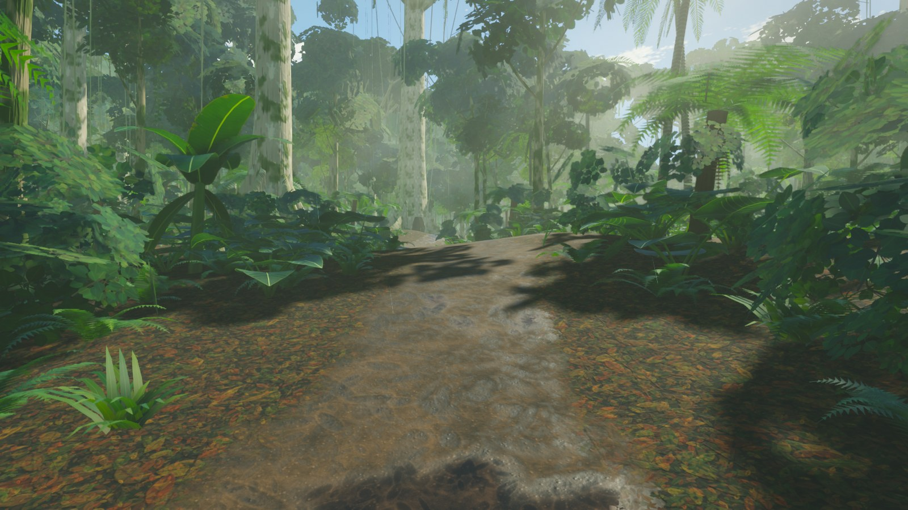

# Iceland Ride · 冰岛长板

A calm, browser-based 3D ride: an electric longboard down an Icelandic fjord valley, plus a walk through a rainforest. Everything you hear — wind, rain, the board, the quiet piano — is generated live in the browser.

一个在浏览器里运行的 3D 解压漫游：踩着电动长板滑下冰岛峡湾山谷，也可以去雨林里走走。风声、雨声、滑板声和幽静的钢琴，全部在浏览器里实时合成。

**▶ Play / 开始：https://wastonD.github.io/iceland-ride/**

Headphones recommended · 建议戴耳机 · Desktop browser with WebGL2 (Chrome / Edge / Firefox) · 推荐电脑端 Chrome / Edge / Firefox



| | |
|---|---|
|  |  |
|  |  |



## Controls · 操作

| Key | Longboard · 滑板 | Walking · 步行 |
|---|---|---|
| W | Motor · 电机加速 | Forward · 前进 |
| S | Foot brake · 脚刹 | Back · 后退 |
| A / D | Steer · 转弯 | Strafe · 左右 |
| Space | Slide to slow down · 侧滑减速 | — |
| Shift | Crouch · 下蹲 | Run · 奔跑 |
| B | Step off and walk · 下板步行 | Back on the board · 上板 |
| C | Sit and enjoy the view · 坐下欣赏 | Sit · 坐下 |
| V | First / third person · 切换视角 | — |
| Mouse · 鼠标 | Look around · 环顾 | Look · 环顾 |

Language, weather, colour look and quality can be changed any time from the panel (bottom-right).
语言、天气、色调、画质都可以在右下角面板里随时切换。

## Run locally · 本地运行

Requires Node.js 20+ · 需要 Node.js 20 以上

```bash
npm install
npm run dev        # http://localhost:5178  (?scene=fjord | rainforest)
npm run build      # → dist/
```

The photo-scanned assets are already in `public/assets/ph/`. To re-download and re-pack them from Poly Haven: `npm run assets:fetch` then `npm run assets:pack` (Windows PowerShell).

## How it's made · 技术

- [three.js](https://threejs.org) + [Vite](https://vite.dev), plain JavaScript, no game engine
- Custom HDR pipeline: TAA, GTAO, screen-space water reflections, volumetric light, film tone curve and grading, cloud shadows
- Longboard physics with tyre friction (grip → slide → crash only when you overcook a bend), kickers, a 3.8 km descent
- All audio synthesized with the Web Audio API: rain, wind, wheels, wildlife and a generative piano score

## Credits · 致谢

- Rendering: [three.js](https://threejs.org) (MIT)
- Photo-scanned textures and rocks: [Poly Haven](https://polyhaven.com) (CC0)
- Music and sound: procedurally generated, original

See `THIRD_PARTY_NOTICES.txt`.
